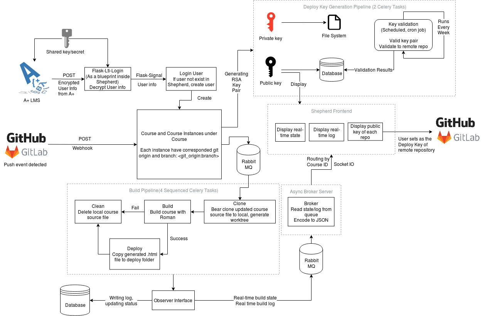

# Shepherd
*The next generation course building CI tool for A+*

## Architecture

Keep updating...

## Project Formation
### Auth
Define user model, get `signal` from `flask-lti-login` and authenicate user.
### Group
Define group model, grouping user by role, grant user different privileges according to the group.
### Build
Define build and buildlog model.
### Courses
Define course instance model, course management interface.
### Webhooks
Handle push webhook in `GitHub` or `Gitlab`.
### Celery Tasks
* Define Build tasks, define automated pipeline (pull/clone->build->deploy->clean).
* Define background task for deploy key pair generation/
* Define the scheduled task for key validation.
### Message Broker
Message broker for updating frontend statues display in realtime, and also routing realtime log output to frontend.
